# Instalace
## Instalace jazyka Python
Pokud máte počítač s Windows, následujte tyto kroky:

1. Ujistěte se, že máte aktualizovaný systém.

2. Jděte na stránku Python Releases for Windows, kde klikněte na Latest Python 3 Release a dole stáhněte Windows installer (64-bit). Stažený soubor spusťte. Rozběhne se průvodce instalací.

3. Na úvodní obrazovce je velmi důležité zaškrtnout volbu Add Python 3.X to PATH (viz obrázek)

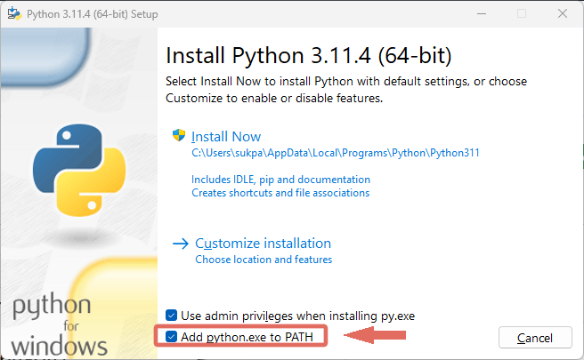


4. Klikněte na Install Now, odsouhlaste případné otázky ohledně změn na vašem počítači a vyčkejte dokončení instalace. Jakmile instalace skončí, zavřete okno tlačítkem Close.

## Instalace editoru Visual Studio Code

1. Z tohoto odkazu si stáhněte Visual Studio Code. https://code.visualstudio.com/download

2. Stažený soubor spusťte. Rozběhne se průvodce instalací, ve kterém stačí klikat na Next tak dlouho, dokud se nespustí instalace. Ve druhém kroku je pouze potřeba souhlasit s licencí.

3. Jakmile instalace doběhne, zavřete okno tlačítkem Finish. Visual Studio Code by se mělo samo spustit ihned po instalaci.

## Rozšíření VS Code pro Python (nepovinné)
Pro jednodušší spouštění programů a automatickou kontrolu syntaxe Pythonu ve VS Code si můžete nainstalovat rozšíření.

1. Na levé liště editoru VS Code klikněte na ikonu "kostek", nebo v horní liště vyberte View → Extensions

2. Do zobrazeného vyhledávacího pole zadejte "python"

3. Jako jeden z prvních výsledků se zobrazí rozšíření Python, jehož autorem je Microsoft a má v rohu hvězdičku, která označuje ověřené rozšíření. Toto rozšíření nainstalujte kliknutím na tlačítko Install (pokud se tlačítko nezobrazuje, rozšíření už pravděpodobně máte nainstalované).

## Ověření instalace Pythonu ve VS Code
Ať už používáte jakýkoliv operační systém, spusťte Visual Studio Code a z horní lišty vyberte Terminal → New Terminal (viz obrázek).

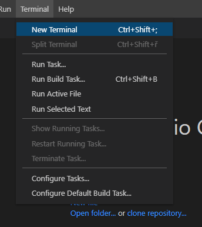

Pokud jste na Windows, napište do okna příkaz, který zobrazí verzi nainstalovaného Pythonu:

```python
python --version
```

Zobrazit se musí něco jako

```python
Python 3.14.0
```

Pokud se zobrazí verze Pythonu alespoň 3.12, vše je připraveno.


# Programování
Existuje mnoho různých programovacích jazyků, možná dokonce až stovky. Všechny tyto jazyky mají v zásadě podobné principy, takže pokud se naučíte jeden z nich, není obtížné naučit se i další. Každý programovací jazyk je však vhodný pro něco jiného. Některé jsou ideální pro tvorbu webových stránek, jiné se uplatní při vědeckých výpočtech a v oblasti umělé inteligence, zatímco další jsou skvělé pro vývoj her.

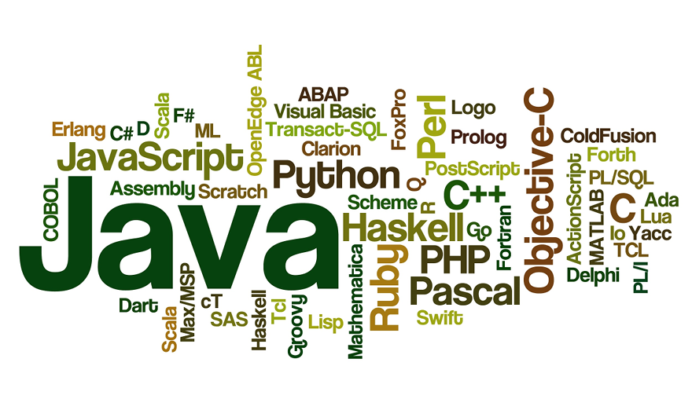

## Python
Python, jeden z nejoblíbenějších programovacích jazyků dnešní doby, má svůj původ v raných 90. letech. Byl vytvořen nizozemským programátorem Guido van Rossumem, který se inspiroval humoristickým televizním pořadem "Monty Python's Flying Circus." První verze Pythonu, Python 0.9.0, byla veřejně uvolněna v únoru 1991. Od té doby prošel Python řadou vývojových verzí a stále se vyvíjí, aby byl efektivní a uživatelsky přívětivý. Python si získal oblibu díky své jednoduché a čitelné syntaxi, která umožňuje programátorům psát kód rychleji a efektivněji. Dnes je Python široce používán ve všech oblastech, zde je seznam nejběžnějších oblastí, ve kterých se Python nejčastěji používá:

* **Webový vývoj**: Python se často používá pro vytváření webových aplikací a serverových backendů. Frameworky jako Django a Flask usnadňují tvorbu robustních webových aplikací.

* **Data Science**: Python je jedním z hlavních jazyků pro analýzu dat a strojové učení. Knihovny jako NumPy, Pandas, Matplotlib a TensorFlow jsou velmi populární pro práci s daty a modelování.

* **Umělá inteligence (AI) a strojové učení**: Python je preferovaným jazykem pro vývoj modelů strojového učení a umělé inteligence. Knihovny jako Scikit-Learn a PyTorch jsou široce používány pro vytváření a trénink modelů.

* **Automatizace a skriptování**: Python je ideální pro automatizaci rutinních úkolů a skriptování. Lze ho použít pro práci s soubory, síťovou komunikaci, a mnoho dalších úkolů.

* **Vědecký výzkum**: Python se používá v akademickém a vědeckém prostředí pro analýzu a vizualizaci dat, simulace a matematické výpočty.

* **Herní vývoj**: Python se používá pro vývoj her, zejména her pro vzdělávání a jednoduché indie hry. Pygame je populární knihovna pro vývoj her v Pythonu.

* **Grafické uživatelské rozhraní (GUI) vývoj**: Pro vytváření desktopových aplikací s grafickým rozhraním se Python často používá. Knihovny jako Tkinter, PyQt a Kivy usnadňují tvorbu GUI.

* **Systémové administrace**: Python je oblíbeným jazykem pro správu a automatizaci systémů a serverů.

* **Finanční analýza a obchodování**: Python se používá pro analýzu finančních trhů, tvorbu obchodních strategií a sledování portfolií.

* **Vývoj mobilních aplikací**: S pomocí některých frameworků lze Python použít i pro vývoj mobilních aplikací.

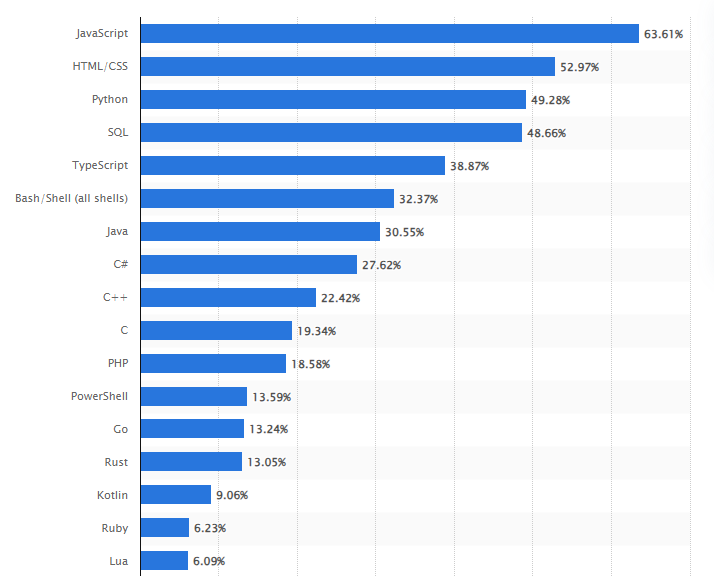

## Programování v době AI

### Kolik kódu dnes píše AI

Graf nahoře ukazuje, které jazyky se používají nejvíc. Stejně důležité je ale to, kdo ten kód dnes píše. Následující čísla zazněla na konferenci WeAreDevelopers 2026.

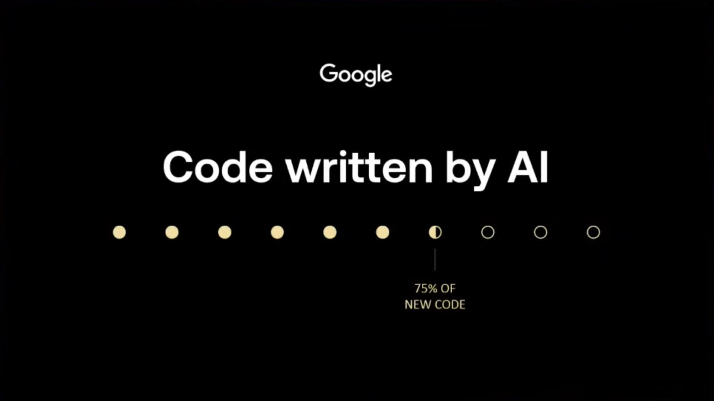

*Google: zhruba 75 % nového kódu ve firmě vzniká s pomocí AI.*

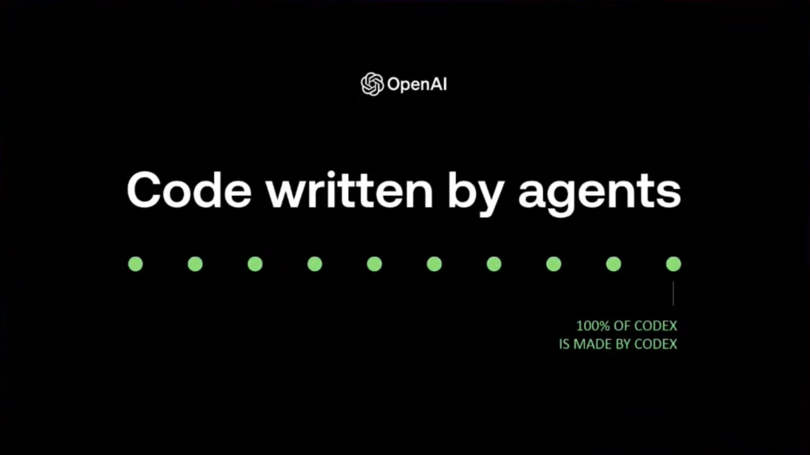

*OpenAI: 100 % kódu nástroje Codex vzniká pomocí samotného Codexu.*

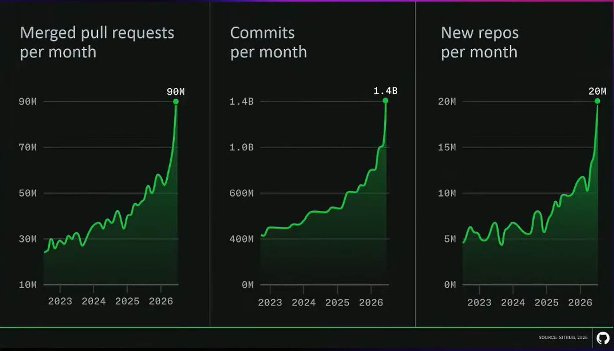

*GitHub, 2026: 90 milionů sloučených pull requestů, 1,4 miliardy commitů a 20 milionů nových repozitářů měsíčně. Všechny tři křivky v posledním roce prudce rostou.*

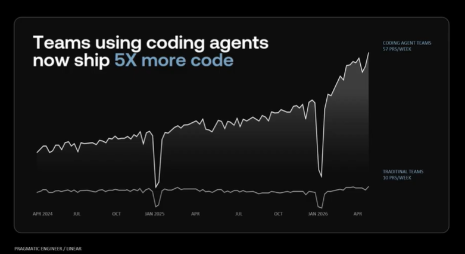

*Pragmatic Engineer / Linear: týmy používající programovací agenty odesílají 5× více kódu, 57 pull requestů týdně proti 10 u tradičních týmů.*

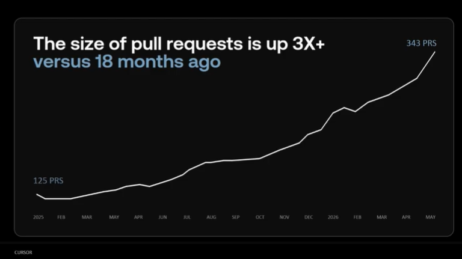

*Cursor: velikost pull requestů se za posledních 18 měsíců téměř ztrojnásobila.*

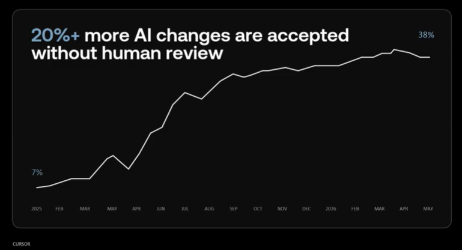

*Cursor: podíl změn od AI, které lidé přijmou bez vlastní kontroly, vzrostl za rok a půl ze 7 % na 38 %.*

Poslední graf je pro tento předmět nejdůležitější. Víc než třetina změn od AI se dnes přijímá, aniž by je někdo přečetl. Tento podíl roste, a s ním roste i množství chyb, které nikdo nezachytil.

### Proč se učit programovat, když to umí AI

Znáte to z navigace v autě. GPS vás dovede téměř kamkoli, ale když vás pošle do řeky nebo do protisměru, musíte to poznat vy. K tomu potřebujete umět číst mapu, i když ji většinu cesty nedržíte v ruce.

S programováním a AI je to stejné. AI asistent napíše kód rychleji než vy. Ale nenese odpovědnost za výsledek. V geoinformatice znamená chybný kód chybnou analýzu, chybnou mapu a nakonec chybné rozhodnutí někoho, kdo té mapě věřil.

Co se s AI mění: strávíte méně času vypisováním syntaxe z hlavy. Co se nemění: musíte umět úlohu **přesně zadat**, výsledek **přečíst**, **ověřit** a **opravit**.

### Číst kód je důležitější než ho psát

Programátoři vždycky četli víc kódu, než ho napsali, s AI se tento poměr ještě zvětšuje, protože většinu kódu, se kterým budete pracovat, jste nenapsali vy.


Zásada, která platí i pro domácí úkoly: **kód, který nedokážete vysvětlit, není váš kód.**

### AI se plete a souhlasí s vámi

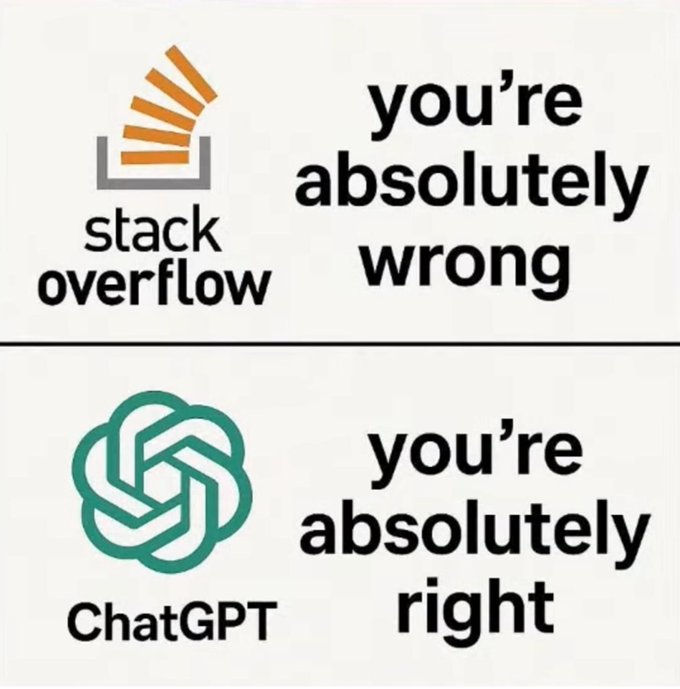


Jazykové modely mají sklon souhlasit s tím, co jim předložíte. Když napíšete „tady má být stupňů, ne radiánů, že?", nejspíš vám dá za pravdu. Když napíšete opak, nejspíš také. Ověření je na vás.

Typické chyby, které AI v kódu dělá:

* vymyslí si funkci nebo knihovnu, která neexistuje,
* použije zastaralou syntaxi nebo starou verzi knihovny,
* udělá logickou chybu a doplní k ní sebevědomý komentář,
* vyřeší jinou úlohu, než jste zadali, protože si zadání vyložila po svém.

#### Ukázka: vzdálenost Brno – Praha

Tohle je kód, který AI běžně vygeneruje na dotaz „spočítej vzdálenost dvou GPS bodů". Nemusíte mu teď rozumět řádek po řádku. Stačí se podívat na výsledek.

```python
import math

lat1, lon1 = 49.19, 16.61   # Brno
lat2, lon2 = 50.08, 14.42   # Praha
R = 6371                    # polomer Zeme v km

dlat = lat2 - lat1
dlon = lon2 - lon1
a = math.sin(dlat / 2) ** 2 + math.cos(lat1) * math.cos(lat2) * math.sin(dlon / 2) ** 2
d = 2 * R * math.asin(math.sqrt(a))
print(round(d), "km")
```

Skutečná vzdálenost je zhruba 185 km. Program vypíše přes 10 000 km, protože goniometrické funkce dostaly stupně místo radiánů. Tuhle chybu poznáte, i když kód nečtete, protože 10 000 km mezi Brnem a Prahou je zjevný nesmysl.

Otázka k zamyšlení: **poznali byste chybu, kdyby program vypsal 212 km?** To už bez porozumění kódu a bez znalosti oboru nejde. A přesně takové chyby se v praxi dělají.

### Jak používat AI, aby vás učila, a ne nahradila

| Takhle se neučíte | Takhle se učíte |
|---|---|
| „Vyřeš úkol 3." | „Vysvětli mi, co dělá tenhle řádek a proč tam je." |
| „Napiš mi program na X." | „Dej mi nápovědu, ne řešení. Jaký má být první krok?" |
| „Nefunguje mi to." | Vložím celý kód, celou chybovou hlášku a napíšu, co jsem čekal a co se stalo. |
| „Je to správně?" | „Najdi v tom chyby a řekni mi, jakými vstupy je otestovat." |
| Nechám AI napsat všechno. | Napíšu to sám a pak nechám AI udělat kontrolu. |
| Skončím, jakmile úkol funguje. | „Vymysli mi tři podobné příklady na procvičení." |

Když od AI dostanete kód, postupujte vždy stejně:

1. Přečtěte ho celý, ne jen první řádky.
2. Spusťte ho.
3. Otestujte ho na hraničních hodnotách: nula, záporné číslo, prázdný vstup, jižní polokoule.
4. Ověřte si, že umíte vysvětlit každý řádek.

### Copilot a našeptávače ve VS Code

VS Code má zabudovaného asistenta Copilot. Bude vám napovídat celé řádky ještě dřív, než je dopíšete. Na prvních hodinách si ho vypněte, aby práci dělal váš mozek, ne našeptávač.

* **Nastavení:** File → Preferences → Settings, do hledání napište `inline suggest` a odškrtněte volbu **Editor › Inline Suggest: Enabled**.
* **Nebo:** klikněte na ikonu Copilota ve stavovém řádku dole a asistenta vypněte.

Až budete mít základy jisté, můžete si ho zapnout zpátky. V té chvíli už poznáte, kdy napovídá špatně.

## Vytvoření programu
Vývojová prostředí se liší od aplikací jako Word nebo Poznámkový blok tím, že neprovádíme otevírání jednotlivých souborů, ale celé složky (adresáře). Skutečné programy bývají často poměrně rozsáhlé, a proto je pro lepší organizaci ukládáme do více souborů. V případě použití Visual Studio Code otevřeme celý adresář a můžeme pohodlně přepínat mezi různými soubory.

Abychom otevřeli adresář, použijeme možnost v menu "File" a zvolíme "Open Folder". Otevře se okno pro výběr adresáře, kde nejprve vytvoříme nový adresář, například s názvem "UvodDoProgramovani". V programování se obvykle vyhýbáme použití diakritiky a mezer v názvech souborů a adresářů. Poté vybereme nově vytvořený adresář a klikneme na "Select Folder".

Visual Studio Code nás následně upozorní a ptá se, zda důvěřujeme autorům programu v otevřeném adresáři. V tomto případě jsme autory my sami, takže zvolíme možnost, že jim důvěřujeme. Poté vytvoříme nový soubor a začneme programovat. K tomu přejdeme do levého panelu, klikneme pravým tlačítkem na prázdné místo a zvolíme "New file". Následně zadáme název programu, který bude mít příponu ".py". Například "program.py". Poté se program otevře v hlavním editorovém okně a můžeme ho upravovat podobně jako textový dokument v Poznámkovém bloku.

# Coding style
Od samého počátku byl programovací jazyk Python navrhnut s ohledem na jednoduchost čtení a pochopení kódu, který napsal někdo jiný. Jedním z charakteristických prvků tohoto jazyka je povinné odsazování bloků kódu, což ho odlišuje od jiných programovacích jazyků, které jsou v tomto ohledu méně striktní. Nicméně, pokud jde o vkládání mezer do kódu na různých místech, existují určitá pravidla, která nám ukazují, kde by se měly mezery používat a kde ne. Důležité pravidlo ohledně vkládání mezer do kódu v Pythonu je, že mezery mají význam. To znamená, že Python používá odsazení mezerami nebo tabulátory k určení bloků kódu a hierarchie. Tímto způsobem je zajištěno, že kód je čitelný a snadno pochopitelný.

Standard formátování kódu PEP 8, což znamená "Python Enhancement Proposal 8," je oficiální style guide pro Python. Byl vytvořen s cílem zajistit konzistenci a čitelnost kódu napsaného v Pythonu napříč různými projekty a programátory. Níže jsou uvedeny některé důležité body a pravidla obsažená v PEP 8:

* **Odsazení**: PEP 8 doporučuje používat čtyři mezery pro jedno odsazení (indentation). Toto je standardní způsob odsazování v Pythonu.

* **Maximální délka řádku**: Doporučuje se, aby délka řádku nepřekročila 79 znaků. Pro komentáře a dokumentační řetězce by měla být maximální délka 72 znaků.

* **Prázdné řádky**: Používejte prázdné řádky k oddělení funkcí a tříd. Mezi jednotlivými částmi kódu by měly být prázdné řádky, aby se zlepšila čitelnost.

* **Importy**: Importy by měly být na začátku souboru, odděleny prázdnými řádky. Importy by měly být seskupeny v následujícím pořadí: standardní knihovny, třetí strany (third-party) knihovny a vlastní moduly. Importy by měly být absolutní (např. `import modul` nebo `from balik import modul`); relativní importy se používají jen výjimečně uvnitř vlastních balíčků.

* **Mezery**: Používejte mezery kolem operátorů (např. x = 10) a oddělovačů (např. funkce(arg1, arg2)). Nepoužívejte mezery uvnitř závorek (např. funkce(1, 2) ne funkce( 1 , 2 )).

* **Komentáře**: Používejte informativní komentáře k vysvětlení částí kódu. Komentáře by měly být psány s velkým počátečním písmenem a konzistentním stylem. Používejte krátké komentáře na jeden řádek (#) nebo dlouhé komentáře na více řádků (uvnitř trojitých uvozovek ''' nebo """).

* **Názvy**: Dodržujte konvenci pro pojmenovávání proměnných, funkcí a tříd. Názvy by měly být popisné a psané malými písmeny s podtržítky pro oddělení slov (např. moje_promenna).

* **Dokumentační řetězce (docstrings)**: Každá funkce nebo třída by měla mít dokumentační řetězec na začátku, který popisuje její funkci a použití.

Dodržování PEP 8 je důležité, protože usnadňuje spolupráci mezi programátory, zlepšuje čitelnost kódu a zvyšuje údržatelnost projektů. Existují nástroje, jako je autopep8, které vám mohou pomoci automaticky upravit kód tak, aby vyhovoval PEP 8.


# Programovací paradigmata
## Procedurální programování
Procedurální programování je programovací paradigma, které se zaměřuje na používání procedur (funkcí nebo metod) pro strukturování kódu. V tomto paradigmatu je program rozdělen do menších procedur, které provádějí konkrétní úkoly. Toto paradigma se často používá v jazycích jako C, Pascal nebo Fortran.

Procedurální programování je vhodné pro menší, jednoduché programy, kde není potřeba složitá struktura. Kód je lineární a rozdělený do jednotlivých funkcí.

## Objektové programování
Objektové programování je programovací paradigma, které se zaměřuje na modelování reálného světa pomocí objektů. Objekty jsou instance tříd a mohou obsahovat data a metody (funkce) pro manipulaci s těmito daty. Toto paradigma je základem jazyků jako Java, Python, C++.

Objektově orientované programování (OOP) je vhodné pro větší a složitější projekty, kde je potřeba pracovat s různými objekty, které mají své vlastnosti a chování. Tento přístup umožňuje lépe strukturovat a spravovat kód.

# Druhy chyb
## Syntaktická
Syntaktická chyba je druh chyby v programu, která se vyskytuje, když kód neodpovídá syntaxi daného programovacího jazyka. Syntaxe jazyka určuje pravidla pro psaní platného kódu, a pokud tyto pravidla nejsou dodržena, program není schopen interpretovat nebo zkompilovat.

### Příklad
```python
# Chyba: chybí dvojtečka na konci podmínky
if 5 > 3
    print("Pět je větší než tři")
```

## Sémantická
Sémantická chyba je druh chyby v programu, která nevyhovuje pravidlům nebo očekáváním v rámci logiky programu. To znamená, že kód může být syntakticky správný, ale jeho chování je nesprávné nebo neintuitivní.

### Příklad
```python
# Chyba: místo sčítání je zde násobení
# Cílem je spočítat součet čísel, ale místo toho je použito násobení
a = 5
b = 10

vysledek = a * b  # Očekává se součet, tedy a + b
print(vysledek)  # Výsledek bude 50, ale očekávaný výsledek je 15 (součet 5 + 10)
```

# Příkazový řádek 
"Starší" způsob ovládání počítače
ještě před textovým nebo grafickým ovládáním počítače
Výhody vs. nevýhody
Spuštění na Windows
Nabídka Start -> vyhledat cmd

```python
dir - vypíše obsah aktuální složky
cd - navigace adresářovou strukturou
cd moje_slozka
cd C:\Windows
cd ..
cls - vymaže okno
copy - kopíruje soubory
del - maže soubory
date - vypíše datum
python - spustí program python (interaktivní konzoli)
a další (https://www.tutorialspoint.com/batch_script/batch_script_commands.htm)
```

# Hodnoty
Hodnoty představují všechny možné druhy dat, se kterými můžou naše programy pracovat. Hodnoty se dle způsobu použití dělí do různých kategoríí zvaných datové typy. Datových typů existuje velké množství. V tuto chvíli si představíme ty nejzákladnější - celá čísla a desetinná čísla.

## Celá čísla
Nejjednodušší datový typ jsou celá čísla. Pod tento typ patří hodnoty jako 12, 1321500, -5, 0 a podobně.

```python
127
```

## Desetinná čísla
S celými čísly bychom si dlouho nevystačili. Dalším datovým typem tedy budou desetinná čísla, např. 13.4, 6.0, -0.0001, 0.0 apod. Pozor, že programátoři vždycky píší desetinná čísla s tečkou, nikoliv s čárkou.

```python
3.141592
```

# Aritmetické operátory
Nyní už máme prostředky k tomu, abychom mohli pomocí Pythonu něco spočítat. V Python máme k dispozici běžné aritmetické operátory:

    sčítání: +
    odčítání: -
    násobení: *
    dělení: /

Díky těmto operátorům můžeme Python použít jako kalkulačku a psát aritmetické výrazy jako

```python
12 * 13 + 10
```

## Výpis na obrazovku
Programy automaticky neinformují o každé operaci, kterou provedou, aby nás nezahltily informacemi. Pokud například program provede nějaký výpočet a my chceme vědět jeho výsledek, můžeme využít tzv. funkci. O funkcích si řekneme později více informací, zatím budeme využívat pouze funkci print(), která vypíše na obrazovku výraz, který zapíšeme do kulatých závorek.

```python
print(12 * 13 + 10)
```

### Spuštění programu
Abychom výsledek viděli, musíme program spustit. Před spuštěním je potřeba soubor uložit, a to pomocí klávesové zkratky nebo pomocí menu File a volby Save. Pokud máme nainstalovaný doplněk Python pro Visual Studio Code, můžeme ke spuštění použít šipku, která se zobrazí vpravo nahoře. Pozor na to, že šipka se zobrazí pouze v případě, že náš soubor má v názvu příponu .py.

Alternativně můžeme ke spuštění programu použít terminál. Ten otevřeme pomocí menu Terminal a volby New Terminal. V dolní části obrazovky se zobrazí terminál, což je textové rozhraní pro komunikaci s počítačem. Do terminálu napíšeme příkaz ke spuštění.

Pokud pracujeme v operačním systému Windows, napíšeme do terminálu

```python
python program.py
```

Část program.py případně nahradíme názvem programu, který chceme spustit.

Pokud používáme operační systém MacOS nebo Linux, pouižjeme příkaz

```python
python3 program.py
```

Opět platí, že část program.py nahradíme názvem programu, který chceme spustit.

Oba postupy spuštění vedou ke stejnému výsledku. Program se spustí a do terminálu vypíše vše, co chceme vypsat pomocí funkce print(). Pokud jsme použili pro spuštění programu šipku a terminál nemáme otevřený, Visual Studio Code nám ho automaticky otevře.

### Další operátory
Python ovšem nabízí ještě další užitečné operátory:

mocnění: **
celočíselné dělení: //
zbytek po dělení: %
Pomocí mocnění můžeme umocňovat čísla, například

```python
print(2 ** 8)
```

Pomocí celočíselného dělení můžeme dělit celá čísla

```python
print(14 // 4)
```

Pokud by nás zajímal zbytek po celočíselném dělení, můžeme použít operátor pro zbytek po dělení

```python
print(14 % 4)
```

### Komentáře
K využití funkcí můžeme přidat vysvětlující poznámku, kterou označujeme jako komentář. Komentář je řádka programu, která má programátorům pomoci se v programu zorientovat a při samotném spuštění ji Python ignoruje. Komentář začítáme symbolem # a za něj můžeme napsat cokoli.

```python
# Mocnina - 2 na 8
print(2 ** 8)
# Celočíselné dělení
print(14 // 4)
# Zbytek po celočíselném dělení
print(14 % 4)
```

# Řetězce
Pokud chceme v Pythonu zadat nějaký kousek textu, použijeme takzvaný řetězec. Řetězce se v Pythonu uzavírají do jednoduchých nebo dvojitých uvozovek. Například:

```python
print('aneta')
print('12. března 2023')
print("prací prášek")
print("Don't panic")
```

Řetězce se v něčem chovají podobně jako čísla, můžeme je například sčítat a násobit. Sčítání spojí řetězce dohromady.
```python
print('aneta' + ' ' + 'ryglová')
#Tento program vypíše
aneta ryglová
```

Násobení opakuje stejný řetězec, přičemž počet opakování je daný číslem, kterým násobíme.
```python
print('bla ' * 10)
#Tento program vypíše
bla bla bla bla bla bla bla bla bla bla
```


