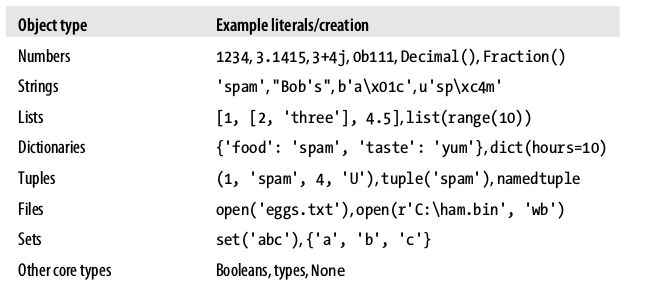
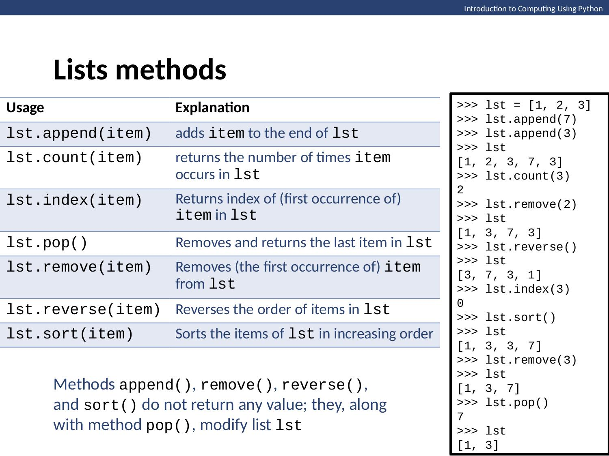
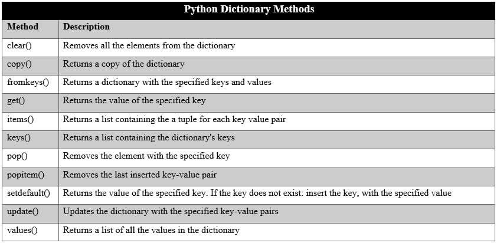
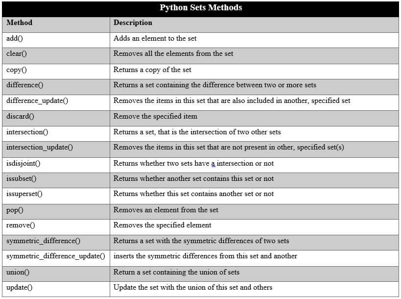

## Datové typy a podmínky

### Datové typy
Základní datové typy:
1. Čísla (number)
2. Řetězce (string)
3. Seznamy (list)
4. Slovníky (dictionary)
5. N-tice (tuple)
6. Množiny (set)
7. Boolean (booleovský typ)
8. Bajty a pole bajtů



#### Čísla
Základní datové typy vztahující se k číslům jsou **integer**, **float**, **boolean**. Některé další např. čísla jiných soustav, komplexní čísla, speciální číselné datové typy Pythonu (Decimal, Fraction apod.).

Typ proměnné nebo literálu můžete zjistit pomocí funkce type()
```python
>>> type(2.0)
<class 'float'>
>>> type('hello')
<class 'str'>
```

Běžné operace s čísly
```python
# Operátor / provádí dělení. Vrací výsledek typu float dokonce i v případě, že činitel i jmenovatel jsou typu int.
>>> 11 / 2
5.5
# Operátor // provádí svým způsobem podivné celočíselné dělení. Pokud je výsledek kladný, můžete o něm uvažovat, že vznikl odseknutím desetinných míst (tedy nikoliv zaokrouhlením). 
>>> 11 // 2
5
# Při celočíselném dělení záporných čísel provede operátor // zaokrouhlení „nahoru“ k nejbližšímu celému číslu. Z matematického hlediska zaokrouhluje „dolů“, protože -6 je menší než -5. Ale pokud byste očekávali, že dojde k odseknutí na -5, tak byste se nachytali.
>>> -11 // 2
-6
# Operátor // nevrací celé číslo vždy. Pokud je čitatel nebo jmenovatel typu float, bude výsledek sice opět zaokrouhlen na celé číslo, ale výsledná hodnota bude typu float.
>>> 11.0 // 2
5.0
# Operátor ** znamená „umocněno na“. 11 na 2 je 121.
>>> 11 ** 2
121
# Operátor % vrací zbytek po celočíselném dělení. 11 děleno 2 je 5 a zbytek je 1. Takže výsledkem bude 1.
>>> 11 % 2
1
```

##### Integer
Jedná se o celé číslo (např. -1, 1000, 234432 apod.). V Pythonu 3 má neomezenou velikost. S celými čísly lze provádět klasické matematické operace.
```python
>>> 1 + 1000
1001
>>> 5 / 2
2.5
>>> 2 * 2
4
>>> 2 ** 8
256
>>> 5 % 2
1
```

##### Float
Číslo s plovoucí řádovou čárkou. (např. 1.15, -43.983, .3 apod.). Platí stejné operace jako v případě integeru. Pozor akorát na nepřesný zápis v případě nekonečné se opakujícího zápisu u float čísel. Tím pádem například číslo 0.1 nebude přesně 0.1, ale bude třeba 0.1000000001 (i když Python ve výpise hodnoty zobrazí pouze 0.1).
```python
>>> 0.1 + 0.1 + 0.1 == 0.3
False
>>> round(0.1 + 0.1 + 0.1, 10) == round(0.3, 10)
True
```

#### Boolean
Hodnota, která může nabývat pouze dvou hodnot (pravda - True a nepravda - False).
```python
>>> False == False
True
>>> False == 0
True
```

#### Řetězce
Označuje datový typ, který uchovává sekvence znaků (slova, věty, text apod.). Řetězce jsou obaleny do uvozovek, jednoduchých ' nebo dvojitých ".
```python
>>> 'Hello'
'Hello'
>>> 'World' == 'World'
True
>>>
```

Řetězce umožňují tzv. **slicing** - výběr jenom určité části řetězce, např.:
```python
>>> var1 = 'Hello world'
>>> var1[1]
'e'
>>> var1[:5]
'Hello'
>>> var1[-4]
'o'
```

Kromě toho můžeme řetězce spojovat pomocí **+** nebo do něj můžeme vkládat hodnoty pomocí **{}**
```python
>>> 'Hello' + ' World'
'Hello World'
>>> 'Hello {}'.format('World')
'Hello World'
```

Řetězce mají spoustu důležitých funkcí, které budeme potřebovat. Alespoň základní je dobré znát z paměti, ty ostatní si můžete vždycky dohledat na internetu. My se naučíme alespoň ```len(str), endswith(suffix, beg=0, end=len(string)), split(str="", num=string.count(str)), upper()```.
```python
>>> len('Hello')
5
>>> 'Hello world'.endswith('world')
True
>>> 'Hello'.upper()
HELLO
>>> 'hello world'.split(' ')
['hello', 'world']
```

#### Seznamy
Seznam (anglicky list) je uspořádané zobrazení (tj. máte zaručeno, že v jakém pořadí do něj něco uložíte, v takovém to tam zůstane), které může obsahovat jakékoliv jiné datové typy. Datové typy mohou být i zanořené, takže seznam v sobě může obsahovat seznam a číslo a seznam může zase obsahovat seznam, číslo nebo cokoliv jiného atd.



Uvozuje se hranatými závorkami a k jednotlivým položkám se přistupuje pomocí indexů, obdobně jako u řetězců.

```python
>>> my_list = ['Hello', 2, 'car', 0.1]
>>> my_list[0]
'Hello'
>>> my_list[-1]
0.1
>>> my_list.append('World')
>>> my_list
['Hello', 2, 'car', 0.1, 'World']
```

#### Slovníky
Do slovníku se nepřistupuje pomocí indexů, ale pomocí klíčů. Každá hodnota tedy musí mít klíč, pomocí, kterého lze danou hodnotu ze slovníku vybrat. Slovník lze vytvořit pomocí složených závorek.



```python
>>> building = {'rooms': 5, 'windows': 7, 'price': 2500000}
>>> building['price']
2500000
>>> building.get('price')
2500000
```

#### Tuply
Tuply jsou seznamy, které jsou uspořádané a nelze měnit! Vytvoříte je jen jednou a pak jsou neměnné. Používá se to spíše jako pojistka pokud máte nějaký seznam, který za žádných okolností nechcete při běhu programu měnit. Tuply se vytváří do kulatých závorek a přistupuje se k nim pomocí indexů.


```python
>>> streets = ('Botanicka', 'Veveri', 'Koliste')
>>> streets[0]
'Botanicka'
```

#### Sety
Sety jsou seznamy, které obsahují každý prvek maximálně jednou. Pokud máte například seznam příjmení, které se vám opakují a vy chcete získat jen unikátní příjmení tak seznam můžete převést na set a získat jen unikátní příjmení. Vytváří se do složených závorek. Protože nejsou sety seřazené tak nemá význam používat indexy. Nelze se dotázat na jednotlivý záznam.



```python
>>> names = {'Petr', 'Martin', 'Simona', 'Simona'}
>>> names
{'Martin', 'Simona', 'Petr'}
>>> names = ['Petr', 'Martin', 'Simona', 'Simona']
>>> names
['Petr', 'Martin', 'Simona', 'Simona']
>>> set(names)
{'Martin', 'Simona', 'Petr'}
```

### Přetypování
Často je potřeba přetypovat hodnoty, například když načteme číslo od uživatele a Python nám ho dá jako řetězec. Pro přetypování se používají funkce pojmenované po datovém typu, např. `float()`, `int()` apod.
```python
>>> int(2.0)
2
>>> float(2)
2.0
>>> bool(1)
True
>>> str(23)
'23'
>>> list('hello world')
['h', 'e', 'l', 'l', 'o', ' ', 'w', 'o', 'r', 'l', 'd']
>>> set('hello world')
{'d', 'e', ' ', 'l', 'o', 'w', 'r', 'h'}
>>> tuple('hello world')
('h', 'e', 'l', 'l', 'o', ' ', 'w', 'o', 'r', 'l', 'd')
```

### Podmínky
Podmínky umožňují v programování reagovat programu na základě určitých hodnot. Například pokud se neúspěšně uživatel přihlásí do nějaké služby, tak mu zamítnete přístup a napíšete chybu přihlášení. Pokud se přihlášení povede, tak mu zobrazíte úvodní stránku apod.

Základní podmínka obsahuje pouze jednu větev, která reaguje na to pokud je podmínka splněna nebo ne.
Podmínky začínají klíčovým slovem **if** a pokračují porovnáním hodnoty pomocí **==**. Pokud je hodnota splněna tak pokračují do části kódu, která je pod **if** a je odsazena 4 mezerami nebo tabulátorem.
```python
var1 = 'hello'
if var1 == 'hello':
    print('it is hello')

if not var1 == 'hello':
    print('it is not hello')
```

Dále může podmínka obsahovat dvě větve pomocí klíčového slova **else**. Pokud neplatí první větev tak se vykoná druhá.
```python
var1 = 24
if var1 >= 20:
    print('You are old')
else:
    print('You are young')
```

Podmínka může mít také víc větví. Pokud jedna podmínka neplatí přejde se na vyhodnocení druhé a další a další.
Pro porovnání více podmínek v jedné můžeme použít operátory **and** a **or**.
```python
var1 = 44
if 15 < var1 < 40:
    print('You are young')
elif var1 >= 40 and var1 < 70:
    print('Soooo old')
else:
    print('You are child or very old guy')
```

Podmínky do sebe můžeme i zanořovat
```python
age = 24
haircolor = 'blond'

if age >= 20:
    print('You are old')
    if haircolor == 'blond':
        print('you are blond')
else:
    print('You are young')
```

### Formátované řetězce
Od verze 3.6 přibyl v Pythonu nový způsob, jak pracovat s řetězci, a to jsou formátované řetězce. Ty umožňují kombinovat vepsaný text s proměnnými bez nutnosti programování převodu vkládaných proměnných.

Formátovaný řetězec musíme od běžného řetězce odlišit písmenem f, které vkládáme před první uvozovku (nebo apostrof). Tím Pythonu říkáme, že daný řetězec je formátovaný řetězce a je nutné věnovat pozornost složeným závorkám uvnitř něj. Podle úvodního písmena f se těmto řetězcům někdy říká f-Strings. Následně můžeme dovnitř uvozovek do složených závorek vkládat proměnné, a to i v případě, že jsou jiného typu než řetězec. Proměnná je automaticky převedena na řetězec a až poté vložena k ostatním částem řetězce.

Například:

```python
cena = 250
print(f"Cena je {cena} Kč.")
# Vypíše: Cena je 250 Kč.
```